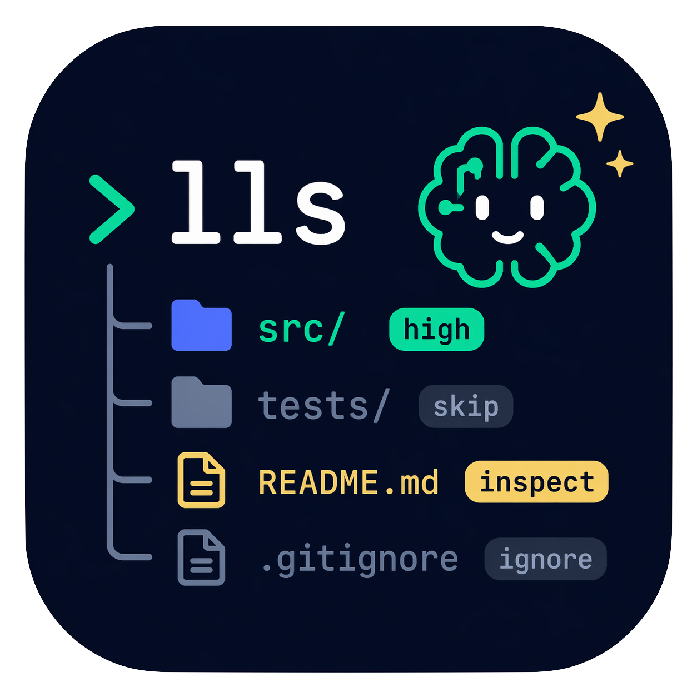

<p align="center">
	
</p>

<h1 align="center">lls</h1>

<p align="center"><strong><code>lls</code> = <code>ls</code> for LLMs</strong></p>

<p align="center">
  <a href="https://github.com/kobayashi-shuto-0105/lls/actions/workflows/build.yaml"></a>
  <a href="https://coveralls.io/github/kobayashi-shuto-0105/lls?branch=main"></a>
  <!--
    Version badge:
    - `.github/scripts/update_version.sh` が README 内のバージョン表記を自動更新できるようにするためのものです。
    - このリポジトリでは `${VERSION}` というプレースホルダを置換して README を生成する想定です。
  -->
  <a href="https://github.com/kobayashi-shuto-0105/lls/releases/tag/v0.1.0"></a>
</p>

`lls` は、LLM やエージェントがリポジトリやディレクトリを探索しやすくするための CLI です。  
通常の `ls` が「何があるか」を並べるのに対して、`lls` は「何が重要か」「何を後回しにしてよいか」「次にどこを見るべきか」を返すことを目指します。

## 概要

リポジトリ探索では、単なるファイル名の一覧だけでは判断材料が足りません。  
特に LLM にとっては、次のような点が最初のボトルネックになります。

- どれが主要なソースコードか
- どれが設定ファイルか
- どれが生成物やノイズか
- どこから読めば全体像をつかみやすいか

`lls` はこの問題に対して、意味付きで優先度のある一覧を返すことで対応します。

## `lls` が返したいもの

想定している出力の方向性は次のとおりです。

- 重要なファイルやディレクトリの抽出
- 役割の推定
- 優先度の付与
- ノイズの識別
- 次に読むべき候補の提案
- LLM が扱いやすい構造化出力

たとえば `README.md` や `Cargo.toml` は高優先度、`target/` や `.git/` は低優先度または無視対象として扱う、というような出し分けを想定しています。

## ドキュメントの役割

このリポジトリでは、ドキュメントの役割を次のように分けます。

- `README.md`: プロジェクトの概要、目的、読み始める人向けの入口
- `.github/assets/spec.md`: 何を作るか、入力と出力は何か、どこまでを最初のスコープにするかを整理する仕様メモ
- `.github/assets/feature-spec.md`: 今後追加したい機能、拡張案、出力スキーマの候補をためていくメモ

詳細な要求整理は [`.github/assets/spec.md`](.github/assets/spec.md) を参照してください。  
将来機能のメモは [`.github/assets/feature-spec.md`](.github/assets/feature-spec.md) に分けて管理します。

## 現在の状況

**MVP 実装は概ね完了しています。** コア機能は実装済みで、テストも整備されています。

## インストール

```bash
# ソースからビルド
git clone https://github.com/kobayashi-shuto-0105/lls.git
cd lls
cargo build --release
# バイナリは target/release/lls
```

`cargo` 経由のインストール（公開後を想定）:
```bash
cargo install lls
```

## Docker

ランタイムイメージは [`Containerfile`](Containerfile) で `dhi.io/debian-base:trixie` を使います。  
ビルド前に `dhi.io` へログインしてください。

```sh
docker login dhi.io
```

イメージをビルド:

```sh
docker build \
  --build-arg GIT_REVISION="$(git rev-parse --short HEAD)" \
  --build-arg BUILD_DATE="$(date -u +%Y-%m-%dT%H:%M:%SZ)" \
  --build-arg VERSION="$(awk -F'"' '/^version *=/{print $2; exit}' Cargo.toml)" \
  -t lls:dev \
  -f Containerfile \
  .
```

CLI を起動:

```sh
docker run --rm lls:dev --help
```

現在のディレクトリを対象に実行:

```sh
docker run --rm -v "$PWD:/work" -w /work lls:dev --no-config -H .
```

マウントしたディレクトリに設定を生成:

```sh
docker run --rm -v "$PWD:/work" -w /work lls:dev setup
```

## 使い方

### 基本実行（設定ファイルまたは `--no-config` が必要）

```bash
# 組み込み既定値で実行（設定ファイル不要）
lls --no-config

# 設定ファイルを生成して通常実行
lls setup --without-codex  # .lls/config.json を作成
lls                        # 発見した設定を使用
```

### 出力モード

```bash
lls --json       # 1行の compact JSON（デフォルト）
lls --human      # 人間向けテキスト表示
lls -l           # long listing 形式
```

### 主なオプション

```bash
lls <path>                   # 特定のパスを走査
lls --depth <0-8>            # 走査深度を指定（既定値: 1）
lls --sort <name|mtime|size|priority>
lls --config <path>          # 設定ファイルを明示指定
lls --no-config              # 設定探索を行わない
```

### Setup

```bash
lls setup                    # Codex を使って設定案を生成
lls setup --without-codex    # 組み込み既定値から設定を生成
lls setup --force            # 既存設定を上書き
lls setup --yes              # 確認プロンプトを省略
```

## 出力例

```json
{"schema_version":"0.1.0","path":".","project_type":{"name":"rust_cli","confidence":0.95,"evidence":["Cargo.toml","src/main.rs"]},"summary":{"total_entries":7,"shown_entries":7,"important_entries":4,"ignored_entries":2},"entries":[{"name":"Cargo.toml","path":"Cargo.toml","type":"file","role":"manifest","priority":"critical","reason_code":"known_manifest","reason":"マニフェストファイル","generated":false,"sensitive":false,"text":true,"binary":false,"size_bytes":1024},{"name":"README.md","path":"README.md","type":"file","role":"project_overview","priority":"critical","reason_code":"project_overview","reason":"プロジェクト概要","generated":false,"sensitive":false,"text":true,"binary":false,"size_bytes":512},{"name":"src","path":"src","type":"directory","role":"source_code","priority":"high","reason_code":"source_code_directory","reason":"ソースコード","generated":false,"sensitive":false,"text":false,"binary":false}],"recommended_next_steps":[{"action":"read","path":"README.md","reason_code":"read_project_overview_first","reason":"プロジェクト概要を把握するため"},{"action":"read","path":"Cargo.toml","reason_code":"read_manifest_first","reason":"プロジェクト構成を理解するため"}],"warnings":[]}
```

## 終了コード

| Code | Meaning |
|-----:|---------|
| `0` | 成功 |
| `1` | CLI 引数エラー |
| `2` | 対象パスが存在しない |
| `3` | 権限不足 |
| `4` | 想定外の実行時エラー |
| `5` | setup が必要（設定ファイル未発見） |
| `6` | Codex CLI / setup エラー |
| `7` | 設定ファイル不正 |

## 開発

```bash
# テスト
cargo test --all-targets --all-features

# Lint
cargo clippy --all-targets --all-features -- -D warnings

# Format
cargo fmt --all -- --check
```
